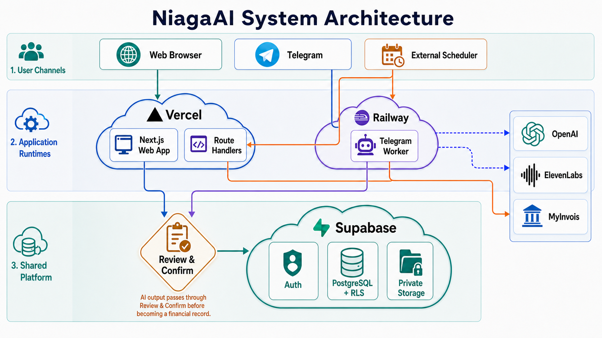
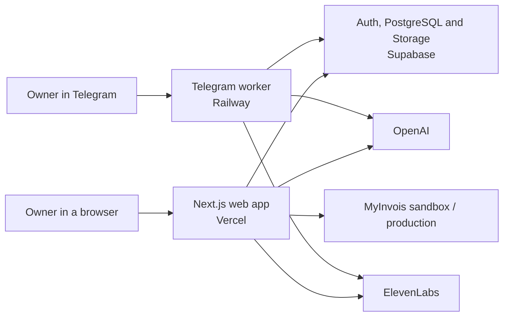
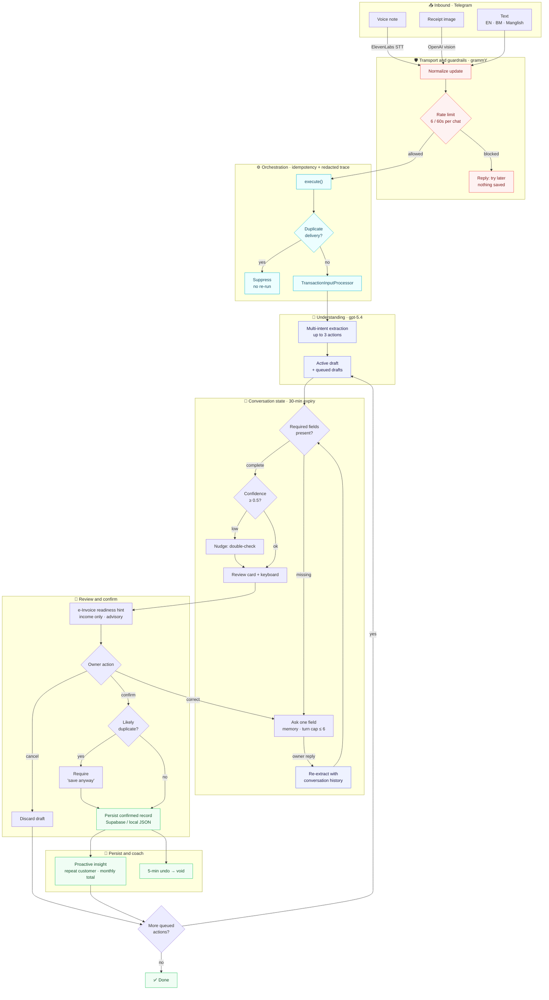
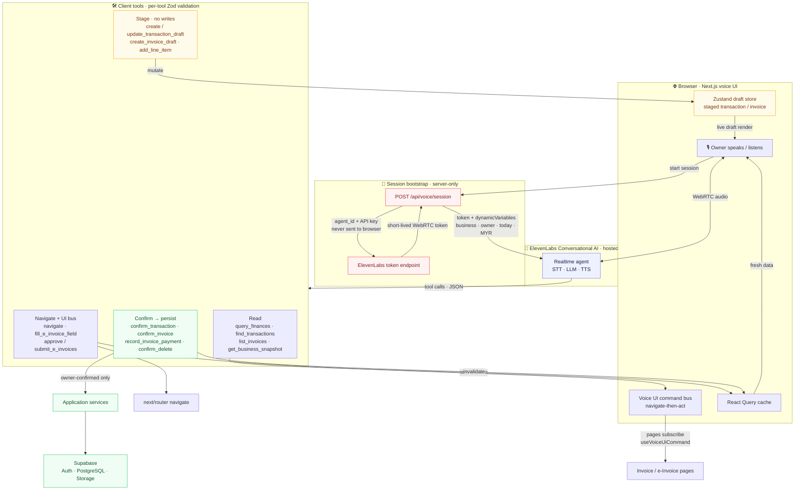

# NiagaAI

Niaga AI is a financial workspace for Malaysian micro and small businesses. It turns receipts, voice notes, spreadsheets, bank statements, and Telegram messages into records that the owner can review before anything is saved.

The repository contains two deployable runtimes—a Next.js web application hosted on Vercel and a long-running Telegram worker hosted on Railway. Both use Supabase in the deployed environment. OpenAI handles structured extraction, ElevenLabs handles speech and the browser voice assistant, and the web application owns the MyInvois integration.

## Platform at a glance





| Runtime | Production host | Entry point | Process model |
| --- | --- | --- | --- |
| Web application and HTTP API | Vercel | `src/app` | Next.js 16 App Router and Node.js Route Handlers |
| Telegram transaction agent | Railway | `src/bot/index.ts` | One persistent Node.js process using grammY long polling |
| Primary data and authentication | Supabase | `supabase/migrations` | PostgreSQL, Auth, RLS, RPCs, and private Storage |

A detailed layered view of the runtimes, domain, services, and persistence is available as a
diagram:



The full system description is in [docs/architecture.md](docs/architecture.md). Deployment ownership and environment-variable placement are in [docs/deployment.md](docs/deployment.md).

## What is implemented

- Supabase authentication, business onboarding, tenant membership, and an explicit browser-local demo mode
- Transaction capture from manual entry, receipt images, voice notes, CSV files, and PDF bank statements
- Reviewed transaction history, dashboard summaries, cash-flow views, reminders, and indicative loan-readiness calculations
- Invoice drafting, lifecycle updates, payment tracking, and immutable e-Invoice preparation revisions
- Unsigned MyInvois Invoice v1.0 mapping, payload snapshots, sandbox submission, status reconciliation, and gated production operations
- A browser voice assistant backed by ElevenLabs Conversational AI, with owner-visible transcript history in Supabase
- A Telegram agent for English, Bahasa Melayu, and Manglish transaction capture, clarification, review, confirmation, duplicate protection, insights, search, and CSV export

Inventory remains a placeholder. Loan readiness is an indicative cash-flow assessment—not a lending decision. Extracted values are proposals until the owner confirms them, and MyInvois readiness is not the same as authority acceptance.

## Telegram agent orchestration

One casual message—text, a voice note, or a receipt—becomes one or more owner-reviewed
records. The agent understands **several transactions at once**, remembers the conversation,
asks only for the fields that are genuinely missing, flags what an income record still needs to
become a **MyInvois e-Invoice**, and coaches the owner after each save. Every message runs
through an idempotent, redacted-trace orchestration boundary, and nothing is stored until the
owner explicitly confirms.



Highlights can see live:

- **Multi-intent** — "sold 5 nasi lemak RM25 cash and beli ayam RM85 semalam" splits into two
  reviewable drafts and walks through them one at a time.
- **Conversation memory** — a later "make it RM55 instead" resolves against prior turns.
- **Field intelligence** — a sale shows exactly which MyInvois fields (e.g. Buyer's TIN g10,
  Classification g28) are still needed, without ever blocking the save.
- **Proactive coaching** — after a save: "That's your 2nd transaction with Ahmad today."

The narrative flow and feature ownership are in [docs/telegram-agent.md](docs/telegram-agent.md).
A standalone SVG of this diagram for slides lives at
[docs/assets/telegram-agent-orchestration.svg](docs/assets/telegram-agent-orchestration.svg).

## Live voice agent orchestration

The browser voice assistant is a second, real-time agent. Unlike the Telegram agent—which runs
its own OpenAI extraction in-process—the voice agent's brain (speech, reasoning, and tool
schemas) is **hosted by ElevenLabs** and reached over WebRTC. This app never exposes the API
key: a server route mints a short-lived session token, and the agent's tool calls are executed
locally against **36 Zod-validated client tools**. The same stage-then-confirm safety applies—
drafts are staged in the browser and nothing is written to Supabase until the owner triggers a
`confirm_*` tool.



What makes it robust:

- **Hosted brain, local hands** — ElevenLabs owns the realtime loop; the app owns tool
  execution, so untrusted tool arguments are re-validated with Zod before anything runs.
- **Stage-then-confirm** — read and stage tools never write; only `confirm_*` tools reach
  services and Supabase, then invalidate the React Query cache so the UI updates instantly.
- **Live context** — `dynamicVariables` seed business/owner/date/currency at session start, and
  `get_current_context` lets long-lived tools read the current page without restarting.
- **Deliberate UI reach** — a small typed command bus (`navigate`, add line item, fill/approve/
  submit e-Invoice) instead of a generic "run any action" hatch.

A standalone SVG for slides lives at
[docs/assets/voice-agent-orchestration.svg](docs/assets/voice-agent-orchestration.svg). The
browser voice feature is documented alongside the workspace in [docs/architecture.md](docs/architecture.md).

## Local setup

NiagaAI declares Node.js 22 as its runtime. Docker Desktop is also required when running the local Supabase stack.

```bash
npm install
cp .env.example .env.local
```

For the quickest UI-only start, set the explicit demo adapter in `.env.local`:

```text
NEXT_PUBLIC_AUTH_MODE=demo
```

Then run:

```bash
npm run dev
```

Open [http://localhost:3000](http://localhost:3000). In demo mode, use `lina@niagaai.demo` with `demo1234`, or create any valid local demo account. Demo records remain in that browser and are never a production security boundary.

For the full Supabase-backed setup—including migrations, local keys, and the Telegram worker—follow [docs/getting-started.md](docs/getting-started.md).

## Common commands

| Command | Purpose |
| --- | --- |
| `npm run dev` | Start the Next.js development server |
| `npm run bot:dev` | Start the Telegram worker in watch mode |
| `npm run bot:start` | Start the Telegram worker once—the command used by Railway |
| `npm run supabase:start` | Start the local Supabase stack |
| `npm run supabase:reset` | Rebuild the local database from migrations and seed data—local data is destroyed |
| `npm run supabase:types` | Regenerate linked Supabase database types |
| `npm run data:import:telegram` | Preview or import local Telegram JSON into Supabase |
| `npm run data:import:myinvois` | Build or verify a pinned MyInvois reference-data candidate |
| `npm run demo:agent` | Run the synthetic Telegram orchestration demo |

## Verification

```bash
npm run lint
npm run typecheck
npm test
npm run build
```

Database changes also require a clean migration reset and the SQL test suite:

```bash
npx supabase db reset
npx supabase test db
```

## Documentation

Start with the [documentation index](docs/README.md). It links the guides for architecture, configuration, web features, HTTP endpoints, Telegram, Supabase, MyInvois, deployment, and engineering conventions.

`PRODUCT.md` records the product boundary. `AGENTS.md` records the repository’s engineering and verification rules.
