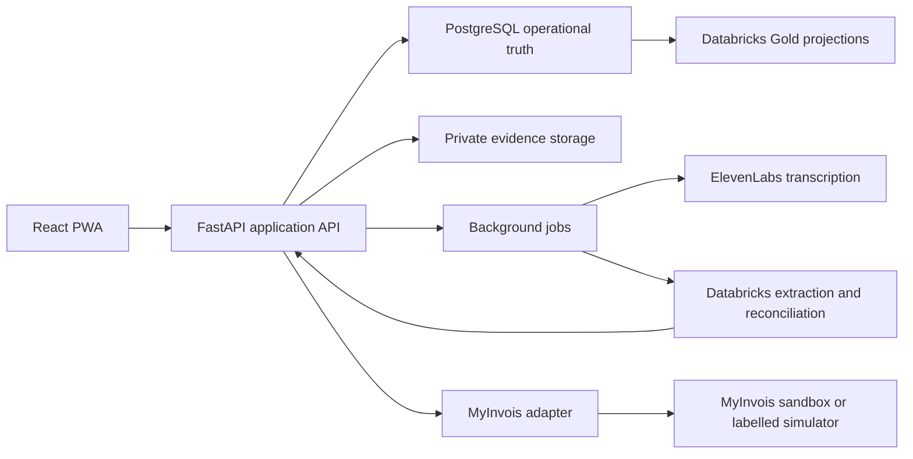

# Technical direction

## Product surface

Build a mobile-first installable web application. A PWA supports camera, microphone and file capture on phones while retaining a desktop review surface and a single deployable codebase. Native applications and live WhatsApp integration do not add enough value to justify their build-week risk.

The initial interface language is English with i18n infrastructure from day one. Malay and other Malaysian languages can be added without coupling stored domain values to display strings.

## Stack

- Frontend: React, TypeScript, Vite, React Router, TanStack Query and i18next
- UI: Tailwind and accessible primitives, with a distinctive Malaysian public-service visual language
- API: Python FastAPI with Pydantic and generated OpenAPI contracts
- Operational data: PostgreSQL with tenant-scoped row-level security
- Evidence files: private object storage with short-lived signed URLs
- Background work: database-backed jobs initially; add Redis only if demonstrated load requires it
- Deployment: standard web hosting for the PWA and API

Sensitive documents must not be retained in a service-worker cache by default. Offline support is limited to unsent drafts and an explicit upload queue.

## System boundaries

PostgreSQL is the operational source of truth. Databricks is the governed intelligence and analytics plane, not a substitute transactional database.

Databricks layers:

- Bronze: immutable evidence metadata and extraction runs
- Silver: normalized candidate transactions, confidence and field-level provenance
- Gold: approved transaction projections and reporting aggregates

Use MLflow traces and evaluation to make extraction and reconciliation behavior inspectable. Unity Catalog governs data assets. Genie is optional and only survives if it answers a visible owner question over Gold data.



The API owns authorization and state transitions. Vendor responses may propose assertions or update an integration lifecycle, but they cannot approve a transaction on the owner's behalf.

## Integrations

### ElevenLabs

Use Scribe speech-to-text for short code-switched voice notes. Preserve audio, transcript and timestamps, and require confirmation for critical amounts, dates and entities. Do not add voice cloning or text-to-speech to the MVP.

### MyInvois

Hide MyInvois behind a versioned adapter that performs taxpayer validation, payload generation, local rules/schema validation, sandbox submission, asynchronous status polling and error repair. A `202` submission response is not a validated invoice.

If sandbox credentials are unavailable by Day 2, use a clearly labelled contract simulator with captured success and rejection fixtures. Never imply that the production system received a document.

### Exa

Exa is optional and outside the transaction decision path. If retained, it updates a sourced requirements library restricted to official HASiL or financing-provider domains and stores the URL, publication date, fetch time and content hash. It never determines compliance or financing eligibility.

## Minimum records

- Business and BusinessOwner
- EvidenceItem with kind, object reference, hash, capture time, consent basis and retention date
- ExtractionRun with model, prompt and schema versions
- CandidateTransaction and line items
- FieldAssertion with value, confidence and evidence location
- ReviewDecision with actor, changes, reason and timestamp
- VerifiedTransaction as an immutable approved version
- ReconciliationLink with suggested and owner-confirmed states
- EInvoiceDraft with document version, payload hash and validation state
- SubmissionAttempt with environment, idempotency key, request identifiers and status
- AuditEvent

Evidence, extraction and approval history is append-only. Corrections produce versions instead of overwriting approved state.

## State transitions

```text
Evidence received
  -> extraction running
  -> candidate draft
  -> needs clarification <-> candidate draft
  -> ready for confirmation
  -> verified transaction
  -> e-invoice draft
  -> locally valid
  -> submitted
  -> validated | needs repair | cancelled
```

Only the application service may transition state. Each transition writes an audit event and checks the expected prior version to prevent stale approvals.

## API boundary

The first implementation needs a small task-oriented API rather than generic CRUD:

- `POST /evidence/upload-intents` creates a private upload target and retention metadata.
- `POST /evidence/{id}/process` starts transcription or document extraction idempotently.
- `GET /transactions/{id}` returns the candidate, assertions, evidence references and blocking checks.
- `POST /transactions/{id}/clarifications` records an owner answer as new evidence and creates a new candidate version.
- `POST /transactions/{id}/confirm` verifies an exact candidate version after deterministic checks.
- `POST /transactions/{id}/reconciliations/{linkId}/confirm` accepts or rejects a proposed bank match.
- `POST /transactions/{id}/e-invoice-drafts` creates a versioned payload from a verified transaction.
- `POST /e-invoice-drafts/{id}/submit` requires a second explicit confirmation and an idempotency key.
- `GET /submissions/{id}` reports the real asynchronous lifecycle without collapsing states.

All mutation endpoints accept an idempotency key. Confirmation endpoints also accept the expected version so retries and stale browser tabs cannot duplicate or overwrite decisions.

## Extraction contract

AI output must conform to a versioned schema and may return `unknown`; it must not invent a plausible value to satisfy a required field. Every assertion contains:

- canonical field path and proposed value;
- confidence used only for review prioritization;
- evidence identifier and page, bounding box, character span or audio timestamp;
- extraction model, prompt and schema versions; and
- conflict, missing-evidence or deterministic-validation flags.

Amounts and taxes are recalculated deterministically after extraction. Duplicate and reconciliation scores remain suggestions until the owner confirms them.

## Trust and privacy baseline

- Show exact source evidence for every critical field
- Treat confidence as advisory and expose missing evidence
- Block approval on arithmetic mismatch, unknown tax treatment, required identity gaps and suspected duplicates
- Require separate confirmation before sandbox submission
- Give upload/recording notice and capture consent
- Minimize collection and support retention, deletion, access, correction and export
- Encrypt data in transit and at rest and isolate each business tenant
- Keep secrets server-side and redact identity/account data from logs and model traces
- Do not train on customer evidence by default
- Use synthetic or redacted Malaysian fixtures for the demo

## Build-week order

1. Evidence upload, canonical schemas and provenance UI
2. ElevenLabs transcription and one supported document extraction path
3. Candidate review, one clarification and immutable approval
4. Bank CSV reconciliation
5. MyInvois draft generation and deterministic local validation
6. Sandbox polling or clearly labelled simulator with rejection repair
7. Databricks lineage, tracing and one Gold completeness view
8. Exa or Genie only if the golden path is already reliable

Kill optional work in this order: Exa, Genie, text-to-speech, broad reporting. Never cut provenance, human review, deterministic validation or reconciliation to preserve optional sponsor features.

## Reliability and demo fallbacks

- Store synthetic golden-path fixtures so a vendor outage cannot destroy the demonstration.
- Demonstrate at least one live transcription or extraction call; clearly label replayed fixture responses.
- Put vendor calls behind timeouts and retry only idempotent operations with bounded exponential backoff.
- Hash uploads and payloads to detect duplicates and prove which version was reviewed or submitted.
- Do not place raw evidence, TINs, bank account numbers or transcripts in application logs.
- Record vendor latency and failure reason without recording sensitive payload content.

## Repository shape

```text
apps/
  web/                 React PWA
  api/                 FastAPI application and MyInvois adapter
packages/
  contracts/           Generated TypeScript client and shared schemas
  ui/                  Accessible UI primitives and design tokens
databricks/
  extraction/          Extraction and reconciliation workflows
  evaluations/         Golden fixtures, metrics and MLflow evaluation
docs/
  adr/                 Durable architectural decisions
```

A monorepo keeps the demo contract, fixtures and UI changes synchronized without requiring distributed deployment architecture.
