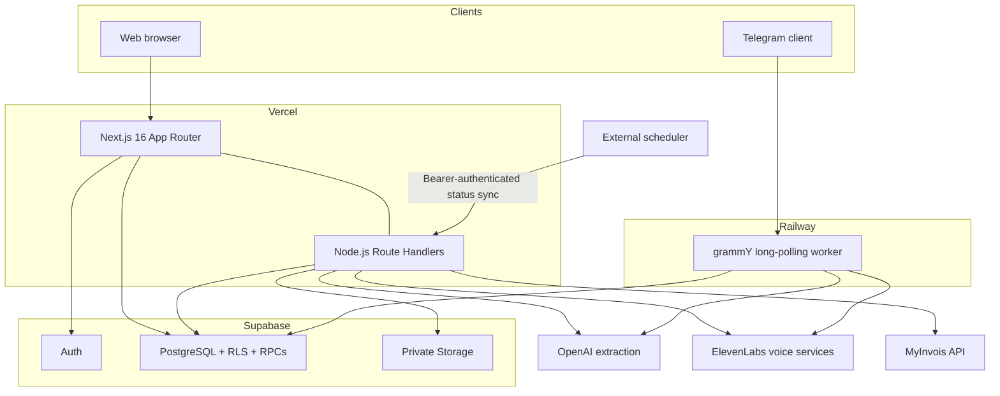

# Architecture

NiagaAI is one product with two application runtimes. Vercel runs the browser application and its HTTP boundaries; Railway keeps the Telegram bot alive as a polling worker. Supabase is the shared identity and data plane in deployed environments.

## Deployment topology



The web and Telegram runtimes share confirmed Supabase transactions only when the bot runs with `BOT_PERSISTENCE_MODE=supabase` and the Telegram account has been linked to an authenticated business. Local JSON bot data and browser demo data are separate by design.

## Web request and data paths

The App Router lives in `src/app`. Pages are Server Components unless a browser API, interaction, or client state requires a smaller Client Component boundary. `src/proxy.ts` refreshes Supabase sessions; authentication and authorization are still repeated at the data or Route Handler boundary.

The main browser data path is:

```text
page → component → React Query hook → service → repository contract → adapter
                                                                      ├── Supabase
                                                                      └── localStorage demo
```

- `src/components` owns rendering and interaction.
- `src/hooks` owns React Query keys, mutations, and dependent-cache invalidation.
- `src/services` coordinates use cases, IDs, dates, fixtures, and related repositories.
- `src/repositories/contracts` keeps the UI independent from storage.
- `src/repositories/supabase` is the default live adapter.
- `src/repositories/local` is selected only when `NEXT_PUBLIC_AUTH_MODE=demo`.

There is no silent fallback. A failed Supabase operation is shown as an error; it is never reported as success or redirected into browser storage.

## Domain and compatibility layers

The current screens still use some contracts from `src/types`. The canonical financial model lives under `src/domain` and uses Zod schemas, branded identifiers, audit metadata, and decimal-safe calculations. `src/frontend/view-models` translates between the two shapes while the UI migration remains incremental.

Keep financial rules in the canonical domain or a focused application service—not in React components. The compatibility adapters are deliberate seams, not permission to create a second business model.

## Transaction capture

Manual, receipt, voice, CSV, bank-statement, and Telegram inputs all end at the same product boundary: prepare a draft, show the owner what was understood, then require confirmation. Provider routes validate file type and size before making external calls. CSV parsing stays in the browser.

In Supabase mode, a web transaction travels through `LegacyTransactionRepositoryAdapter`, is converted into the canonical transaction shape, and is written by `SupabaseTransactionRepository`. Removing a transaction means voiding it—the audit trail is retained.

The exact sequence is documented in [transaction-data-flow.md](transaction-data-flow.md).

## Invoice and e-Invoice boundaries

Billing invoices and MyInvois preparation are related but not interchangeable:

```text
invoice draft → issued invoice → payment lifecycle
       │
       └── e-Invoice preparation revision
             → owner/admin approval
             → immutable unsigned v1.0 payload snapshot
             → sandbox or gated production submission
             → scheduled status reconciliation
```

`src/application/e-invoices` owns the use cases. `src/compliance/myinvois` owns field rules, reference codes, validation, and UBL mapping. `src/integrations/myinvois` owns OAuth, environment-scoped secret resolution, and HTTP transport. Supabase owns immutable revisions, payload hashes, submission history, leases, and operator events.

Approval freezes the prepared document snapshot. Corrections create a new revision—they never rewrite a submitted payload.

## Telegram worker

`src/bot/index.ts` is the Railway process entry point. It loads and validates the environment, registers bot commands, starts long polling, and handles graceful shutdown. `src/bot/telegram-bot.ts` adapts Telegram updates into use cases under `src/features/transaction-agent`.

In Supabase mode, a private-chat link code connects a Telegram identity to an authenticated business member. The worker uses a service-role client, so every operation must resolve that link and active membership before reading or writing. The service role is transport authority—not user authorization.

Inbound updates receive an idempotency key and a redacted orchestration trace. Drafts, clarification state, duplicate checks, confirmation, and undo remain isolated by Telegram user and chat.

## Voice boundaries

There are two voice paths:

- Uploaded or recorded transaction audio is transcribed by ElevenLabs Scribe, then structured by OpenAI into a reviewable transaction draft.
- The `/voice` experience uses an ElevenLabs Conversational AI agent. Vercel mints a short-lived token, while browser client tools stage and confirm application actions.

In Supabase mode, text turns can be stored in `voice_conversations` and `voice_conversation_turns` for the signed-in owner. Raw call audio is not stored by this application path. Rows carry a 90-day deletion target, but a scheduler must perform the deletion before the product can claim automatic expiry.

## State ownership

| State | Owner | Notes |
| --- | --- | --- |
| Supabase Auth session | Supabase cookie session | Refreshed at the request boundary |
| Business and financial records | Supabase PostgreSQL | Tenant-scoped through membership and RLS |
| Demo user and records | Browser `localStorage` | Explicit demo mode only |
| React Query data | Browser memory | Cache—not a source of truth |
| Temporary UI and draft navigation | Zustand and component state | Reset on sign-out as appropriate |
| Telegram drafts and conversations | Supabase in deployment; JSON locally | Never mix the two adapters |
| e-Invoice payloads and history | Supabase immutable records | Server-controlled revisions and events |
| Provider credentials | Vercel or Railway environment | Never stored in client bundles or logs |

## Trust boundaries

- Browser input, uploaded files, provider output, Telegram updates, and URL parameters are untrusted.
- Supabase publishable keys may reach the browser; service-role, provider, Telegram, and MyInvois secrets may not.
- RLS is a second line of defence—not a substitute for checking the user, membership, role, and business at each operation.
- Model output can suggest fields but cannot confirm a financial record.
- MyInvois HTTP 202 means submitted—not valid or accepted.
- Logs may include safe identifiers and error codes, but not tokens, evidence contents, transcripts, unsigned payloads, or raw provider responses.

## Tests by seam

Pure domain and integration rules are tested near their modules. Repository and service tests protect storage behavior, component tests use accessible UI queries, Route Handler tests exercise HTTP boundaries, and Telegram tests cover user/chat isolation and repeated callbacks. Database migrations and RLS have pgTAP tests under `supabase/tests/database`.
