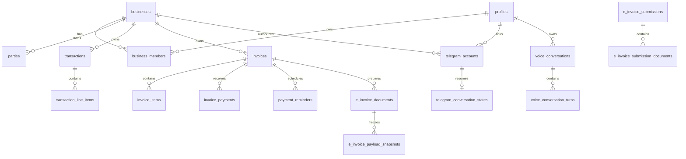

# Data model

Supabase PostgreSQL is the deployed source of truth. Ordered SQL files under `supabase/migrations` define the schema, RLS policies, grants, triggers, and security-definer functions. Generated TypeScript types are a projection of the applied schema—they are not the schema authority.

## Core relationships

## Identity and tenancy

`profiles` extends Supabase Auth users. `businesses` is the tenant root, and `business_members` assigns an active role such as owner, admin, accountant, or staff. Business identifiers, addresses, contacts, settings, and tax details are normalized into child tables.

Tenant reads and writes are scoped by `business_id`. RLS policies rely on active membership, while higher-risk database functions check the allowed role again. A service-role client bypasses RLS, so trusted workers must establish actor and business authorization before calling it.

## Parties and catalog

`parties` represents customers, suppliers, individuals, government entities, foreign entities, and the general public. Tax identifiers, registration identifiers, and addresses are stored separately. `products_services` and tags provide reusable catalog and classification records.

Invoices also keep supplier and customer snapshots. Those snapshots preserve what was issued even when the live party or business profile changes later.

## Transactions and evidence

`transactions` stores direction, lifecycle, dates, counterparty snapshot, category, currency, minor-unit totals, payment state, e-Invoice treatment, source provenance, confirmation, and void metadata. Related tables hold normalized lines, evidence links, tags, and lifecycle history.

The important lifecycle states are proposed, review-required, confirmed, and voided. Web and Telegram confirmation paths write audit evidence; removing a confirmed record means voiding it rather than deleting it.

Evidence metadata lives in `evidence_files`, while private bytes belong in Supabase Storage. Extraction runs and field results remain separate from confirmed transactions—the output can be reviewed, retried, or rejected without changing the ledger.

## Invoices, payments, and reminders

`invoices` and `invoice_items` own the billing document and its calculated lines. Database functions enforce draft saving, issuance, payment allocation, reversal, voiding, totals, status history, and audit events. `invoice_payments` records allocations; it is not represented by simply changing an invoice status.

`payment_reminders` and `reminder_deliveries` track scheduled messages and delivery attempts. The current UI can record reminder activity, but no email, WhatsApp, or SMS delivery provider is wired into the web application.

## e-Invoice preparation and MyInvois

The active MyInvois path uses the `e_invoice_*` tables:

- `e_invoice_documents` stores tenant-scoped preparation revisions and frozen party/document snapshots;
- `e_invoice_payload_snapshots` stores exact unsigned Invoice v1.0 JSON bytes, hashes, and mapper/reference versions;
- `myinvois_connections` stores environment-scoped connection metadata and opaque secret references;
- `e_invoice_submissions` and `e_invoice_submission_documents` store attempts and document outcomes;
- `e_invoice_status_events`, `e_invoice_operation_events`, and cancellation records preserve reconciliation and operator history;
- rate-limit buckets, leases, retries, and dead-letter fields support safe worker recovery.

Historical `einvoice_submissions` and signing tables remain for forward-migration compatibility. New application code uses the underscored v1.0 path and does not create signed v1.1 payloads.

## Telegram

`telegram_link_codes` stores one-time code digests and expiry—not raw codes. `telegram_accounts` links a Telegram user/chat pair to a Supabase user and business. Draft and workflow state is stored in `telegram_conversation_states`; preferences are stored per linked account.

Confirmed Telegram transactions enter the shared `transactions` table through an idempotent database function. `agent_orchestration_runs` and `agent_orchestration_steps` store redacted execution metadata without raw receipt text, transcripts, or financial payloads.

Local bot mode writes versioned JSON files instead. Those files are development records and never merge automatically into Supabase; the import script requires an explicit account mapping and dry run.

## Voice conversations

`voice_conversations` belongs to both a business and an individual user. `voice_conversation_turns` is ordered by a per-conversation turn index and can be upserted as streaming text becomes more complete. RLS prevents coworkers from reading one another’s transcript solely because they share a business.

The application does not store call audio in this path. A 90-day `retention_delete_after` timestamp marks the intended retention boundary, but deletion requires an operational cleanup job.

## Audit, imports, and idempotency

`audit_events` records safe before/after summaries for sensitive changes. `idempotency_keys` prevents repeated external delivery or callback processing from duplicating a write. `integration_events` supports durable outbound work. `data_import_batches` makes browser and Telegram migrations explicit, reportable, and repeatable.

## Money and time conventions

Database monetary columns use integer minor units where practical. Canonical TypeScript domain types use decimal strings for calculations and convert deliberately at adapters. User-facing formatting uses `Intl` with MYR defaults.

Business reporting and Telegram summaries use `Asia/Kuala_Lumpur` unless the owner has chosen another supported reporting timezone. Persist timestamps as timezone-aware UTC values and keep accounting dates as explicit dates—do not derive them from a browser locale at persistence time.
