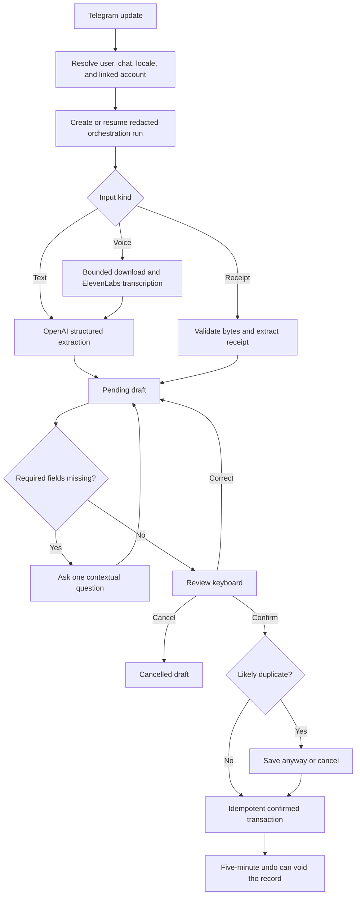

# Telegram transaction agent

The Telegram agent is a long-running grammY worker. Railway hosts the deployed process; local development uses the same entry point with either Supabase or versioned JSON persistence.

It accepts English, Bahasa Melayu, and Manglish transaction text, voice notes, and one clear MYR receipt image. Every input becomes a pending draft. The bot asks for missing details, shows what it understood, and saves only after an explicit confirmation.

## Runtime

`src/bot/index.ts` loads `.env.local` through the Next.js environment loader, validates the bot configuration, registers commands, starts long polling, and stops on `SIGINT` or `SIGTERM`.

```bash
npm run bot:dev    # local watch mode
npm run bot:start  # single process—used by Railway
```

Railway configuration is in `railway.toml`. The worker does not expose a web server or Telegram webhook; it makes outbound polling and provider requests.

## Commands

| Command | Purpose |
| --- | --- |
| `/start` | Introduce the bot and show the home keyboard |
| `/link <code>` | Link a private chat to an authenticated NiagaAI business in Supabase mode |
| `/help` | Show supported inputs and examples |
| `/transactions` | Show the latest confirmed, non-voided records |
| `/summary [from to]` | Summarise cash movement for the current month or an explicit date range |
| `/insights` | Start a read-only financial insight question |
| `/search <text>` | Search bounded confirmed transaction history |
| `/export <from> <to>` | Send a bounded, spreadsheet-safe CSV transaction export |
| `/settings` | Set language, reporting timezone, and default payment method |
| `/cancel` | Leave the current clarification or correction flow |

The persistent home keyboard covers common commands, so slash commands are not required for ordinary capture.

## Configuration

The worker requires:

```text
TELEGRAM_BOT_TOKEN
OPENAI_API_KEY
OPENAI_TRANSACTION_MODEL
ELEVENLABS_API_KEY
```

`ELEVENLABS_STT_MODEL`, `MAX_VOICE_FILE_BYTES`, and `LOCAL_DATA_DIRECTORY` have safe development defaults. Railway also needs `NEXT_PUBLIC_SUPABASE_URL` and `SUPABASE_SERVICE_ROLE_KEY` because deployed persistence must use Supabase.

The complete matrix is in [configuration.md](configuration.md).

## Input flow



Temporary receipt and voice files are removed in `finally` blocks. Orchestration traces keep safe timing, provider, intent, and outcome metadata—not raw input, transcript text, receipt contents, or the financial draft.

## Supabase persistence

`BOT_PERSISTENCE_MODE=supabase` is the deployed mode. A signed-in member generates a short-lived link code from the web settings page. Only the digest is stored. `/link <code>` consumes it in a private chat and creates or updates the `telegram_accounts` relationship.

For each later operation, the worker resolves the numeric Telegram user and chat IDs, the linked Supabase user, the business, and an active transaction-capable membership. The worker holds a service-role key, but it never treats possession of that key as the authorization decision.

| Data | Supabase owner |
| --- | --- |
| Link and identity | `telegram_link_codes`, `telegram_accounts` |
| Active draft and workflow | `telegram_conversation_states` |
| Language and reporting preferences | `telegram_user_preferences` |
| Confirmed and voided records | Shared canonical `transactions` tables |
| Idempotency and audit | Database functions, `idempotency_keys`, lifecycle history, audit events |
| Redacted execution trace | `agent_orchestration_runs`, `agent_orchestration_steps` |

Confirmation uses a database function that checks the link and active membership again, claims an idempotency key, and writes the transaction and traceable lifecycle evidence. Repeated Telegram delivery or callback presses must not create a second record.

## Local JSON persistence

`BOT_PERSISTENCE_MODE=local` is for development, automated tests, and the repeatable synthetic demo. It creates versioned JSON files under `LOCAL_DATA_DIRECTORY` for drafts, transactions, conversations, preferences, receivables, and orchestration traces.

Local files are not a production database. The bot serializes writes to reduce corruption risk, but operators must stop the process and inspect or back up a damaged file—it is never deleted automatically. Local bot records are not visible in the web app and never migrate silently into Supabase.

The explicit Telegram import script requires a reviewed mapping from Telegram identities to existing linked account UUIDs. Run its dry mode before any commit; [supabase-operations.md](supabase-operations.md) has the command sequence.

## Integrity rules

- Conversation state is scoped by both Telegram user and chat.
- Only a pending draft can be corrected, cancelled, or confirmed.
- One active draft is allowed per user/chat; a second transaction requires a keep, replace, or cancel choice.
- Missing fields are asked one at a time, with bounded clarification turns.
- Likely duplicates require a separate **Save anyway** action.
- Undo voids rather than deletes, and only inside the five-minute window.
- Recent lists, summaries, insights, search, and export exclude voided records.
- Default payment method applies only when the source did not state one.
- Financial insights are deterministic and read-only—the model may phrase the answer but may not invent figures.

## Media boundaries

Receipt capture accepts one JPG, PNG, or WEBP up to 10 MiB. The worker checks the actual byte signature rather than trusting Telegram metadata. PDFs, multi-receipt images, unreadable images, and non-MYR receipt drafts are rejected.

Telegram voice notes are bounded by `MAX_VOICE_FILE_BYTES`, transcribed with ElevenLabs, and structured with OpenAI. The bot keeps the reviewed draft and source metadata; it does not keep the temporary audio file.

## Where changes belong

| Concern | Location |
| --- | --- |
| Startup, grammY handlers, and shutdown | `src/bot` |
| Localised copy and keyboards | `src/bot/messages`, `src/bot/keyboards` |
| Schemas, extraction, clarification, confirmation, insights, and workflows | `src/features/transaction-agent` |
| Telegram media downloads | `src/lib/telegram` |
| Voice transcription | `src/lib/elevenlabs` |
| Receipt and text extraction | `src/lib/openai`, transaction-agent extractors |
| Supabase trusted client | `src/bot/supabase-admin.ts` |

Keep transport handlers thin. A new command or input should first have a schema and feature-layer rule, then repository behavior, tests, localised copy, and finally grammY wiring.

## Verification

Test private linking, expired and reused codes, unlinked rejection, cross-business access, English and Malay copy, text/voice/receipt inputs, missing fields, corrections, duplicates, repeated callbacks, undo expiry, provider failures, corrupt storage, and graceful shutdown.

The repeatable synthetic walkthrough and safe local reset are recorded in [telegram-demo.md](telegram-demo.md).
