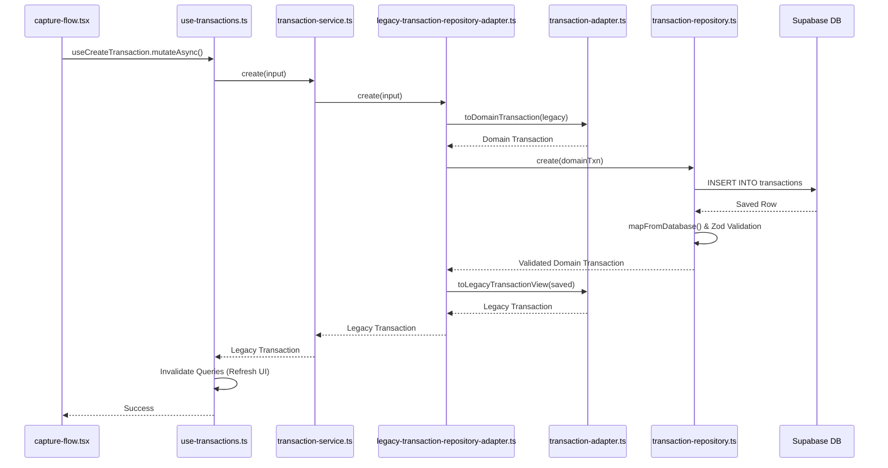
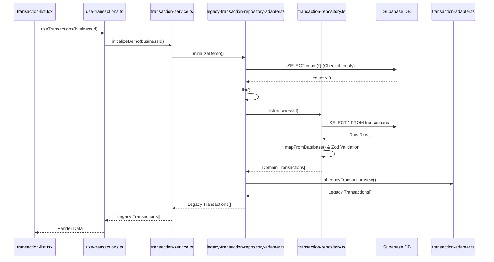

# Transaction Data Flow

This document outlines the end-to-end process of how a transaction is recorded (saved) and displayed (fetched) in the application. It follows the architecture from the frontend UI, through the React Query caching layer, into the Service layer, and finally down to the Supabase database.

## 1. Transaction Recording (Creation) Flow

When a user approves a new manual entry, receipt, or CSV import, the data flows from the UI down to the database.

### File-by-File Breakdown

1. **`src/components/transactions/transaction-capture-flow.tsx` (UI Component)**
   - **Method**: `confirm(values)`
   - **Process**: Gathers all the form values from the UI, constructs a legacy `Transaction` object (without an ID or dates yet), and triggers the React Query mutation.

2. **`src/hooks/use-transactions.ts` (State & Caching)**
   - **Method**: `useCreateTransaction` -> `mutationFn`
   - **Process**: Acts as the bridge between the UI and the backend logic. Upon success, it automatically runs `invalidateTransactionDependents` to refresh the dashboard and transaction list so the UI shows the new data instantly.

3. **`src/services/transaction-service.ts` (Business Logic)**
   - **Method**: `create(input)`
   - **Process**: Generates a unique `id` (e.g. `txn_abc123`) and sets the `createdAt` and `updatedAt` timestamps before handing it off to the repository.

4. **`src/repositories/supabase/legacy-transaction-repository-adapter.ts` (Adapter)**
   - **Method**: `create(input)`
   - **Process**: Takes the legacy `Transaction` object and passes it to `transaction-adapter.ts` (`toDomainTransaction`) to convert it into the strict, e-invoicing compliant `FinancialTransaction` format.

5. **`src/repositories/supabase/transaction-repository.ts` (Database Layer)**
   - **Method**: `create(transaction)`
   - **Process**: 
     1. Formats the data for PostgreSQL using `mapToDatabase()`.
     2. Runs the Supabase query: `.from("transactions").insert(...)`.
     3. Takes the returned row and runs it through `mapFromDatabase()`, which includes the **strict Zod schema validation** (`financialTransactionSchema.parse`) to ensure no corrupted data enters the app.

---

## 2. Transaction Display (Fetching) Flow

When a user visits `/transactions` or `/dashboard`, the data is fetched from the database and formatted for the UI.

### File-by-File Breakdown

1. **`src/app/transactions/page.tsx` & `src/components/transactions/transaction-list.tsx` (UI)**
   - **Method**: `useTransactions(businessId)`
   - **Process**: The React component mounts and requests the transaction data. It uses the `visible` memoized array to filter and sort the data on the client side before rendering the table.

2. **`src/hooks/use-transactions.ts` (State & Caching)**
   - **Method**: `useTransactions` -> `queryFn`
   - **Process**: Triggers the fetch. React Query will cache this data and supply it instantly if the user navigates away and comes back, only refetching in the background.

3. **`src/services/transaction-service.ts` (Business Logic)**
   - **Method**: `initializeDemo(businessId)`
   - **Process**: Simply delegates the call to the repository adapter.

4. **`src/repositories/supabase/legacy-transaction-repository-adapter.ts` (Adapter)**
   - **Method**: `initializeDemo()` and `list()`
   - **Process**: 
     1. First checks if the database is completely empty (using a lightweight `head: true` count query). If empty, it seeds the demo data.
     2. Since data exists, it calls its own `list()` method.
     3. After `list()` gets the data from the repository, it uses `toLegacyTransactionView()` to translate the strict `FinancialTransaction` back into the simpler `Transaction` format the UI components currently expect.

5. **`src/repositories/supabase/transaction-repository.ts` (Database Layer)**
   - **Method**: `list(businessId)`
   - **Process**: Executes `.from("transactions").select("*").eq("business_id", businessId)`. Each row returned from Postgres is passed through `mapFromDatabase()` to ensure it still conforms to the Zod schema before hitting the frontend.
