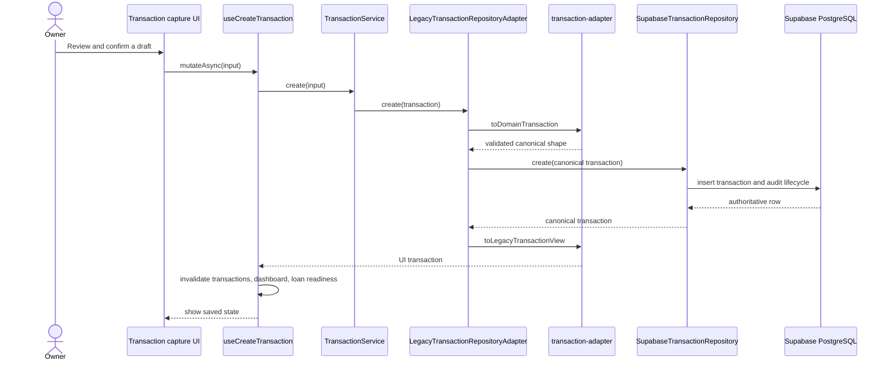
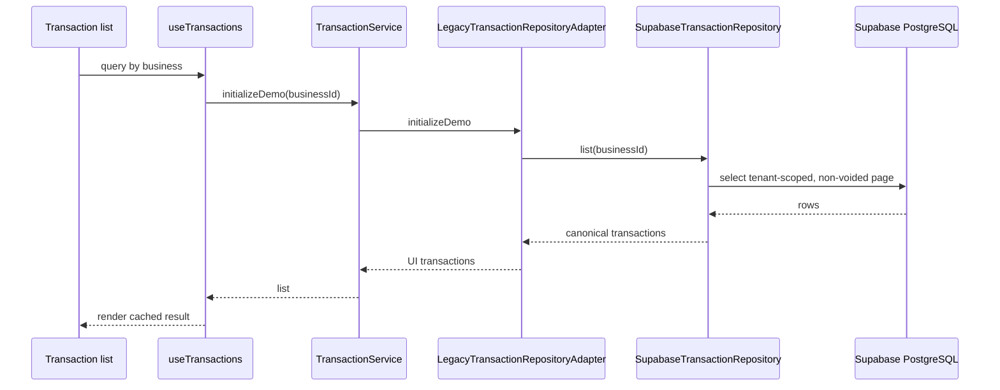

# Transaction data flow

The web transaction screens still use the legacy UI type, while Supabase stores the canonical transaction model. The adapter between them is intentional—it keeps the active screens stable while domain migration continues.

## Create and confirm



The browser-created identifier is not authoritative in Supabase mode. PostgreSQL generates the record UUID, and the saved row is mapped back to the UI. Zod validation runs at the compatibility boundary before the write and again when database rows become canonical objects.

The capture source—manual, receipt, voice, CSV, or bank statement—does not change this confirmation path. Provider output only prepares the values shown in the review form.

## List and display



`initializeDemo` is a compatibility method name. The Supabase adapter never inserts fixtures—it simply lists persisted records. Only the local demo adapter seeds deterministic data when a business has no records.

## Update and void

An edit first loads the existing row, merges the allowed UI changes, converts the complete result back into the canonical model, and writes through the Supabase repository. Transaction removal calls the void operation with an audit reason; the database retains the row and lifecycle history.

After either mutation, the hook invalidates every dependent React Query surface. A successful local component state change without a successful repository result is not considered a saved transaction.

## Telegram confirmation

Telegram has a separate capture and review state machine, but Supabase confirmation ends in the same canonical `transactions` table:

```text
Telegram update
  → linked account and active membership
  → redacted orchestration run
  → extraction and clarification
  → pending draft
  → explicit confirmation
  → idempotent confirm_telegram_transaction RPC
  → canonical transaction and audit evidence
```

The local Telegram adapter writes JSON instead and does not appear in the web workspace. There is no automatic merge between local bot files and browser demo records.
